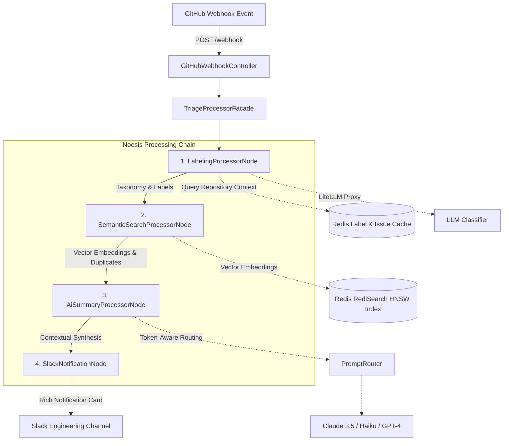

# Noesis 🧠
### Autonomous Engineering Issue & Cognitive Intelligence Engine

[](https://openjdk.org/)
[](https://spring.io/projects/spring-boot)
[](https://redis.io/)
[](https://spring.io/projects/spring-cloud-openfeign)
[](https://www.testcontainers.org/)

---

## 📌 Executive Overview

In large open-source repositories and high-velocity engineering organizations, **issue fatigue** is a primary cause of maintainer burnout and delayed incident response. Duplicate bugs, vague bug reports, and misclassified priorities overwhelm developer inboxes.

**Noesis** (from the Greek *nóēsis* — intuitive intellectual insight and higher cognition) is an autonomous, event-driven issue triage engine. Operating as a GitHub webhook listener, Noesis automates the full lifecycle of issue triage:

1. **Intelligent Classification & Taxonomy**: Analyzes issue semantics against the live repository label ecosystem and generates precision tags.
2. **Vector Similarity Deduplication**: Vectorizes issue text into a 1536-dimensional space and queries Redis Stack using **HNSW (Hierarchical Navigable Small World)** indexing to surface duplicates and historic precedents.
3. **Context-Aware Synthesis**: Synthesizes technical summaries conditioned on both the current issue and historical duplicates.
4. **Targeted Dispatch & Alerting**: Delivers actionable triage cards with similarity scores and deep links directly to engineering channels via Slack webhooks.

---

## 🏗️ Architecture & Pipeline Flow

Noesis is architected around a resilient, decoupled **Chain of Responsibility** pipeline orchestrated by `TriageProcessorFacade`.



### Data Pipeline Stages:

| Stage | Node Component | Responsibility | Tech Details |
|---|---|---|---|
| **01** | `LabelingProcessorNode` | Classify issue category, severity, and component | Multi-tiered cache on Redis to avoid GitHub API rate limits |
| **02** | `SemanticSearchProcessorNode` | Duplicate detection & vector embedding storage | 1536-dim embeddings stored in Redis Stack using cosine distance |
| **03** | `AiSummaryProcessorNode` | 1–3 sentence actionable root-cause summary | Conditioned on current issue + historical duplicate context |
| **04** | `SlackNotificationNode` | Deliver actionable card to maintainer channels | Markdown formatting with match percentages & direct hyperlinks |

---

## 💡 Key Design Patterns & Engineering Highlights

### 1. Chain of Responsibility Pattern
Each step in the triage lifecycle inherits from `AbstractTriageProcessorNode` and implements `ChainNode<T>`. This allows:
- **Pluggability**: Add or remove processing stages (e.g., auto-comment bot, Jira synchronizer) without touching existing nodes.
- **Resilience**: Independent error boundaries per node ensure non-fatal failures (e.g., Slack rate-limiting) do not fail upstream vector indexing.
- **Observability**: Execution latencies are tracked and logged per pipeline node.

### 2. Retrieval-Augmented Generation (RAG) & Vector Deduplication
Instead of simple keyword matching, Noesis utilizes dense vector search powered by **Redis Stack (RediSearch)**:
- Creates an HNSW index (`INDEX_NAME = "noesis_issue_idx"`) on startup with `DISTANCE_METRIC = COSINE`.
- Executes KNN vector queries (`*=>[KNN 3 @embedding $vec_param AS score]`).
- Stores issue title, body, and URL alongside embeddings in Redis hashes for zero-lookup retrieval.

### 3. Dynamic Cost- & Token-Aware LLM Routing
The `PromptRouter` evaluates incoming task context (task type, estimated token volume, cost sensitivity) to dynamically select the optimal model:
- **High-volume / Routine labeling**: Fast, cost-efficient models (e.g., `gpt-3.5-turbo` or Claude 3 Haiku).
- **Complex summarization / Long stack traces (>8,000 tokens)**: Claude 3.5 Sonnet.
- **Precision reasoning**: GPT-4.

### 4. Two-Tier Multi-Level Redis Caching
To protect against strict GitHub API rate limits:
- Repository taxonomies/labels are cached with a 1-hour TTL (`CACHE_TTL_SECONDS = 3600`).
- Representative exemplar issues per label are cached with a 30-minute TTL (`ISSUES_CACHE_TTL_SECONDS = 1800`).

### 5. Declarative OpenFeign Integration
External integrations (GitHub REST API, LiteLLM AI Gateway, Slack Incoming Webhooks) are defined via Spring Cloud OpenFeign declarative interfaces, avoiding boilerplate HTTP client code.

---

## ⚙️ Tech Stack

| Layer | Technologies |
|---|---|
| **Language & Runtime** | Java 17 LTS |
| **Core Framework** | Spring Boot 3.5.3, Spring Cloud 2025.0.0 |
| **Declarative Clients** | Spring Cloud OpenFeign, Jackson Databind (JSR-310) |
| **Vector DB & Caching** | Redis Stack Server, Jedis 5.x (RediSearch + HNSW) |
| **AI Gateway** | LiteLLM (OpenAI, Anthropic Claude, Google Gemini proxy) |
| **Testing** | JUnit 5, Mockito, AssertJ, Testcontainers (Redis Stack container) |
| **Build Tool** | Apache Maven 3.9+ |

---

## 🚀 Getting Started

### Prerequisites
- **JDK 17** or later
- **Docker** (to run Redis Stack)
- (Optional) LiteLLM proxy instance & Slack Webhook URL

### 1. Spin up Redis Stack with Docker

```bash
docker run -d \
  --name noesis-redis-stack \
  -p 6379:6379 \
  -p 8001:8001 \
  redis/redis-stack-server:latest
```

### 2. Configure Environment Variables

Create a `.env` file or export the following variables in your terminal:

```bash
# Redis Configuration
export REDIS_HOST=localhost
export REDIS_PORT=6379
export REDIS_PASSWORD=

# LiteLLM / Model Proxy
export LITE_LLM_BASE_URL=http://localhost:4000
export LITE_LLM_API_KEY=your-litellm-or-openai-key

# GitHub Token (for fetching repository labels and exemplar issues)
export GITHUB_TOKEN=ghp_yourPersonalAccessToken

# Slack Webhook for Alerts
export SLACK_WEBHOOK_URL=https://hooks.slack.com/services/YOUR/SLACK/WEBHOOK
```

### 3. Build & Run Noesis

```bash
# Clone the repository
git clone https://github.com/your-username/noesis.git
cd noesis

# Build and execute unit tests
./mvnw clean test

# Launch the Spring Boot application
./mvnw spring-boot:run
```

---

## 📡 API Reference & Verification

### 1. Diagnostic / Health Status Endpoint
Inspect active pipeline stages and engine readiness:

```bash
curl -X GET http://localhost:8080/api/v1/system/status
```

**Response (200 OK):**
```json
{
  "platform": "Noesis - Autonomous Engineering Triage & Intelligence Engine",
  "version": "1.0.0",
  "status": "UP",
  "bootTime": "2026-09-23T11:45:00.000Z",
  "pipelineStages": [
    "LabelingProcessorNode (AI Classification & Taxonomy)",
    "SemanticSearchProcessorNode (Vector RAG & Deduplication)",
    "AiSummaryProcessorNode (Contextual Summarization)",
    "SlackNotificationNode (Maintainer Dispatch & Alerting)"
  ],
  "vectorEngine": "Redis HNSW Indexing",
  "modelGateway": "LiteLLM Multi-Provider Proxy"
}
```

### 2. Simulate a GitHub Webhook Event
Send a mock GitHub issue creation event to trigger the pipeline:

```bash
curl -X POST http://localhost:8080/webhook \
  -H "Content-Type: application/json" \
  -d '{
    "action": "opened",
    "issue": {
      "id": 10928374,
      "number": 42,
      "title": "JedisConnectionException: Unexpected end of stream on cluster failover",
      "body": "Under 15,000 req/sec load, nodes failover causes Jedis client pool exhaustion and connection drop.",
      "html_url": "https://github.com/my-org/core-engine/issues/42",
      "repository_url": "https://api.github.com/repos/my-org/core-engine"
    }
  }'
```

**Response (200 OK):**
```json
{
  "status": "SUCCESS",
  "issueId": 10928374,
  "issueTitle": "JedisConnectionException: Unexpected end of stream on cluster failover",
  "action": "opened",
  "assignedLabels": ["bug", "performance", "redis-cluster"],
  "similarIssuesCount": 2,
  "summary": "Connection pool exhaustion observed during cluster node failover under high throughput."
}
```

---

## 🧪 Testing Strategy

Noesis enforces comprehensive testing across both unit and integration levels:

```bash
# Run unit test suite (isolated mocks using Mockito & AssertJ)
./mvnw test -Dtest="*Test"

# Run integration tests (spins up real Redis Stack instance via Testcontainers)
./mvnw test -Dtest=TriageWorkflowIT
```

- **`TriageWorkflowIT`**: End-to-end integration test spinning up a Dockerized Redis Stack instance using Testcontainers, initializing HNSW vector indices, inserting test embeddings, and validating KNN query retrieval and webhook dispatch.
- **`LabelingServiceTest`**: Validates caching hit/miss behavior and prompt construction.
- **`AISummaryServiceTest`**: Validates LLM response sanitization and context assembly.
- **`PromptRouterTest`**: Validates cost/urgency/token routing rules.
- **`GitHubWebhookControllerTest`**: Validates webhook payload ingestion and HTTP status code contract.

